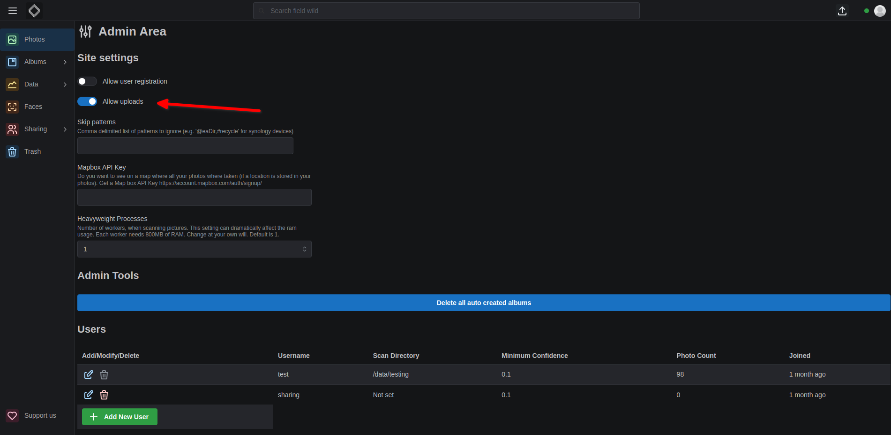

In the top right corner of the web interface, there is an upload button. Clicking it will open a file picker. You can select multiple files and upload them.

### What kinds of files are supported?

We accept all files that have a mime type of image or video.

### How does it work?

The upload process works in the following way:

- Check if file is on the server by comparing the hash `md5 + user_id`
- If it is, don't upload it
- If it isn't, upload it
- We upload files in 1MB chunks
- If all files are uploaded, we scan the your `scan folder + /uploads/web`

### Where are the files saved?

The upload behavior depends on whether the user has a scan directory configured:

#### When scan directory is properly configured:
- Files are saved to: `{scan_directory}/uploads/web/{filename}`
- This is the normal and expected behavior
- Files are stored in the mounted host directory and are persistent

#### When scan directory is NOT configured (⚠️ Problem):
- Files are saved to: `uploads/web/{filename}` (relative path)
- This resolves to `/code/uploads/web/{filename}` inside the container
- **Files are stored inside the container's filesystem**
- **Files will be lost when the container is restarted or recreated**
- This is the issue described in [librephotos-docker#144](https://github.com/LibrePhotos/librephotos-docker/issues/144)

### Prerequisites for upload

To use the upload feature properly, you **must** have:

1. **Upload feature enabled**: Set `ALLOW_UPLOAD=true` in your environment variables or enable it in the admin panel
2. **Scan directory configured**: Every user must have a scan directory set up by an admin

### How to configure scan directory

1. **Admin users only**: Only admins can set scan directories for users
2. **Access admin panel**: Click on your avatar (top right) → `Admin Area`
3. **Set scan directory**: Manually set the `Scan Directory` for each user
4. **Verify path**: The directory must exist and be accessible to the container

### Activate / Deactivate the upload feature



You can activate / deactivate by navigating as an admin to the admin area and clicking on the `Allow uploads` switch. You can also set this by setting the environment variable `ALLOW_UPLOADS` to `true` or `false`.

### Scanning uploaded photos

After upload, you can scan the uploaded photos in two ways:

1. **Automatic scanning**: The upload process automatically triggers processing for the uploaded photo
2. **Manual scanning**: You can manually scan all uploaded photos by going to the Library page and clicking the scan button

### Troubleshooting

#### Files disappear after container restart
**Cause**: This happens when the user doesn't have a scan directory configured.
**Solution**: Set up a scan directory for the user via the admin panel.

#### Upload fails with permission errors
**Cause**: The container doesn't have write permissions to the scan directory.
**Solution**: Check the directory permissions and ensure the container can write to the mounted directory.

#### Upload button not visible
**Cause**: Upload feature is disabled.
**Solution**: Enable uploads via environment variable `ALLOW_UPLOAD=true` or in the admin panel.

### Docker configuration for uploads

If you're using Docker and want to ensure uploads are properly mounted (workaround for missing scan directory):

```yaml
backend:
  volumes:
    - ${scanDirectory}:/data
    - ${data}/uploads:/code/uploads  # Workaround for users without scan directory
```

However, the proper solution is to ensure all users have scan directories configured rather than relying on this workaround.
